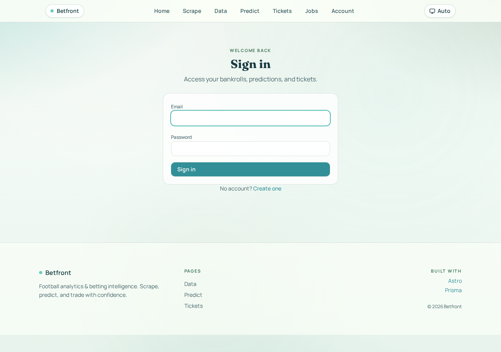
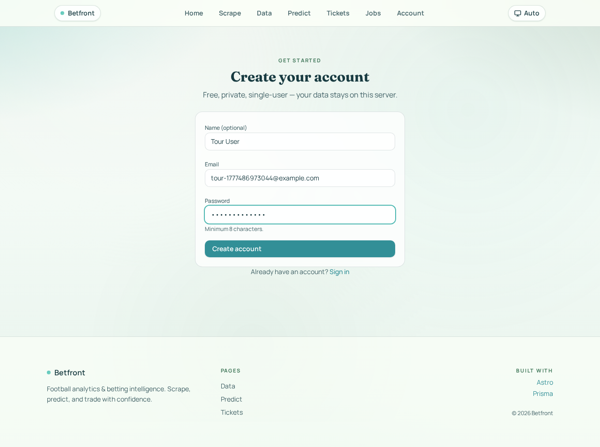
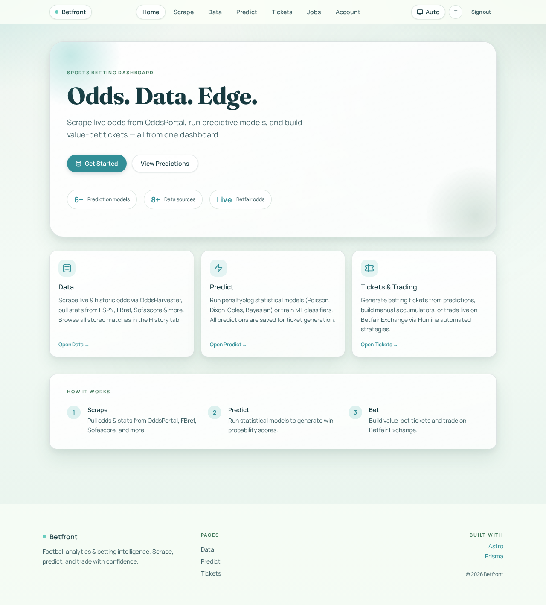
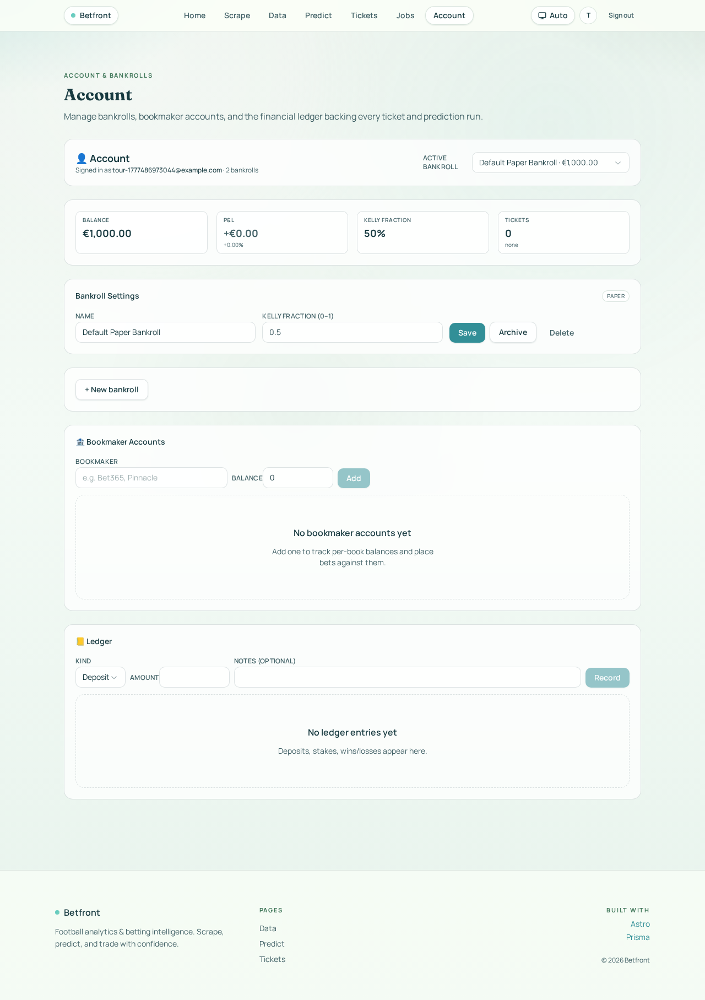
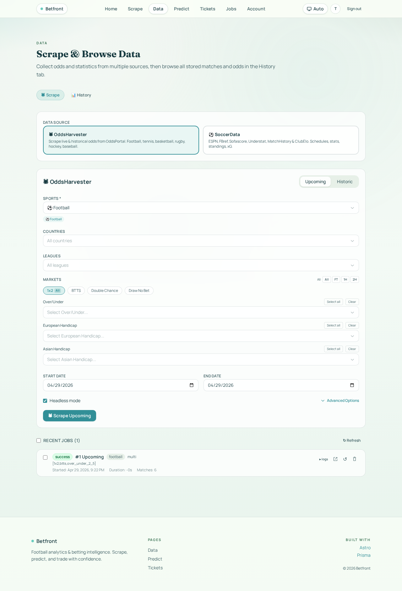
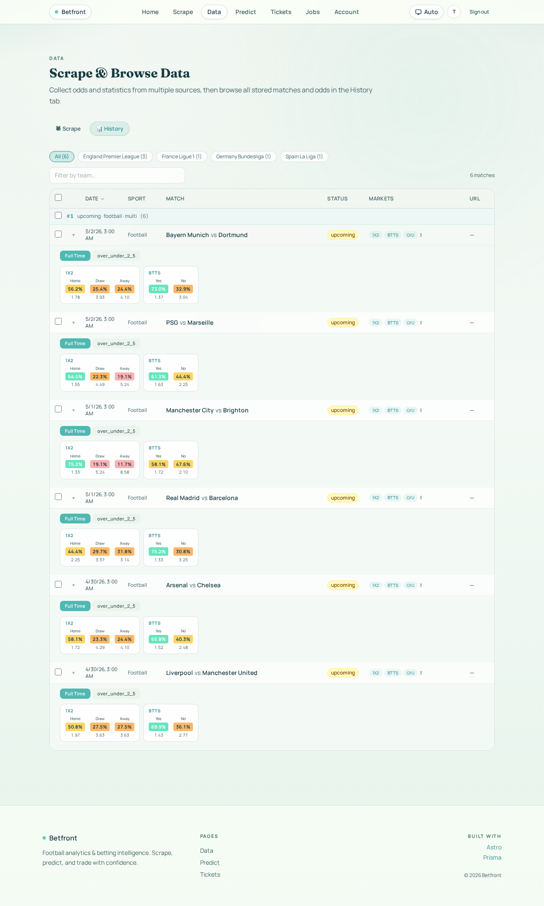
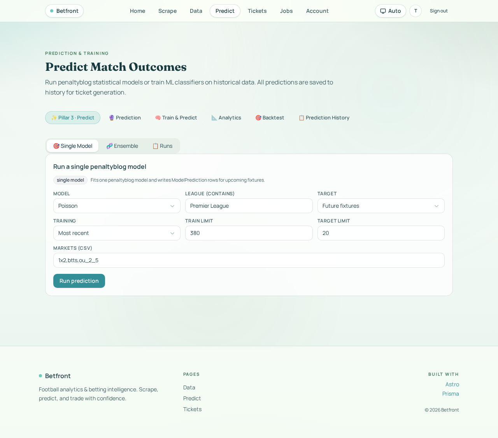
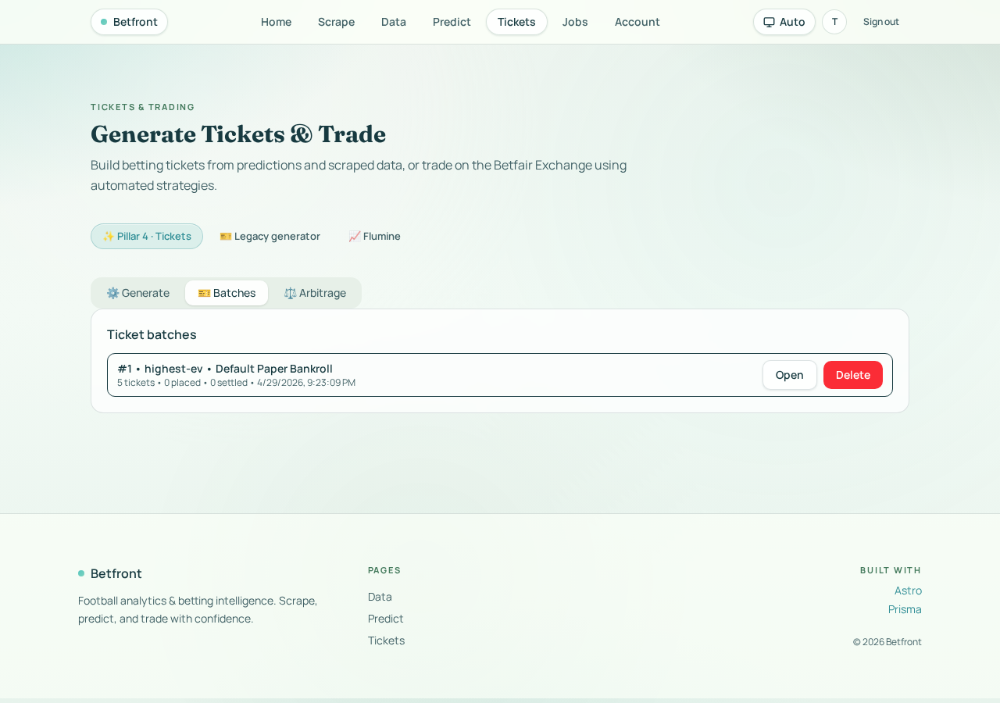
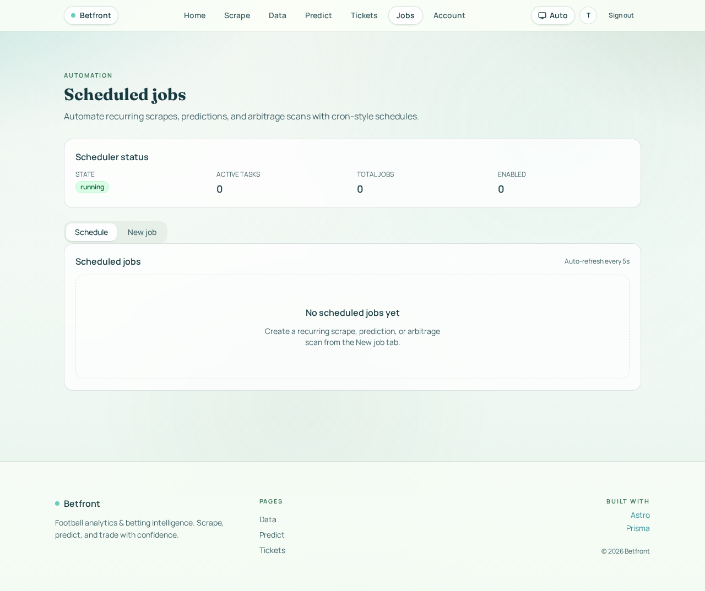

# How to use Betfront

This is a screenshot-driven tour of the whole platform — from creating an account to scraping odds, running predictions, generating value-bet tickets, and scheduling automated jobs.

The four "pillars" of Betfront map 1:1 to the top-nav items:

| Nav | Pillar | What it does |
|---|---|---|
| **Data** | 1 · Acquisition | Scrape live & historic odds (OddsHarvester) and match stats (soccerdata) |
| **Predict** | 3 · Prediction | Run penaltyblog statistical / Bayesian models on stored fixtures |
| **Tickets** | 4 · Tickets & Trading | Turn predictions into value-bet tickets, place & settle them, or run Flumine on Betfair Exchange |
| **Jobs** | 5 · Automation | Cron-style scheduler for recurring scrapes / predictions / arbitrage scans |

Plus **Account** for bankroll & ledger management. ([Pillar 2 — Backtesting — lives inside the Predict tab.](#step-5--predict))

---

## Step 1 — Create an account

Visiting `/` while logged out takes you straight to **Sign in**:



Click **Create one**, fill name + email + password (≥ 8 chars), then **Create account**:



The signup endpoint ([`api/auth/signup.ts`](../src/pages/api/auth/signup.ts)) hashes the password with `scrypt`, creates a `Session`, sets the `betfront_session` cookie and redirects to `/`.

## Step 2 — The dashboard

Once logged in, `/` becomes the marketing-style dashboard with three quick-jump cards (Data, Predict, Tickets):



The top-right shows your **avatar pill** + **Sign out**. The "Auto" pill toggles dark/light theme.

## Step 3 — Account & bankroll

Click **Account** in the nav. On your very first visit, [`ensureDefaultBankroll`](../src/server/account.ts) creates a paper bankroll seeded with €1000:



From this page you can:
- Rename the bankroll, change its **Kelly fraction** (default 0.5), or delete it
- Click **+ New bankroll** to add a *real* / *sandbox* / *paper* second bankroll
- Add **Bookmaker accounts** (only required when you want to *place* tickets later)
- Inspect the **Ledger** (deposits, stakes, settlements) and **Account summary** (ROI, P&L)

## Step 4 — Data: scrape & browse

Click **Data**. The default tab is **Scrape** with two source cards:



- **OddsHarvester** — scrapes upcoming or historic odds from OddsPortal across football, tennis, basketball, rugby, hockey, baseball. Pick **Upcoming** or **Historic**, narrow by countries / leagues / markets (1×2, BTTS, Over/Under, Asian Handicap, etc.), set a date range, and hit **Scrape Upcoming**. Jobs run via the [Python bridge](../src/server/scraper.ts) into `OddsHarvester/.venv` and append to the **Match** + **OddsEntry** tables. Recent jobs appear at the bottom with logs.
- **SoccerData** — pulls schedules, stats, standings and xG from ESPN, FBref, Sofascore, Understat, MatchHistory, ClubElo via the `soccerdata/.venv` bridge.

Switch to the **History** tab to browse everything you've stored:



Each match expands into per-market odds (1×2, BTTS, O/U) with implied probabilities colour-coded by edge. League pills along the top filter the table, and a free-text "Filter by team" narrows further.

## Step 5 — Predict

Click **Predict**. The default **Pillar 3 · Predict** tab gives you a single-model runner:



Pick a `Model` (Poisson, Dixon-Coles, Bayesian Hierarchical, etc.), optionally narrow by `League`, choose `Target = Future fixtures` (or a date window), and click **Run prediction**. The penaltyblog Python bridge ([`predictions.ts`](../src/server/predictions.ts)) fits the model on `Train limit` recent matches, scores `Target limit` upcoming fixtures across the listed `Markets (csv)` (`1x2,btts,ou_2_5` by default), and writes a `PredictionRun` + child `ModelPrediction` rows.

The other tabs let you:
- **Ensemble** — blend multiple models with weights
- **Train & Predict** — train an ML classifier (logistic regression, RF, XGBoost) and persist it
- **Analytics** — calibration, log-loss, Brier breakdowns per model run
- **Backtest** (Pillar 2) — replay a strategy across historic fixtures and chart cumulative P&L
- **Prediction History** — list every `PredictionRun` with filters & deletion

## Step 6 — Tickets

Click **Tickets**. The default **Pillar 4 · Tickets** tab is the ticket generator:


Set the bankroll, ticket count, legs/ticket, stake, edge threshold, Kelly cap, etc., then pick a strategy from the **Strategy** dropdown (8 algorithms — see [TUTORIAL-tickets.md](./TUTORIAL-tickets.md) for the full reference). Click **Generate batch**.

Switch to the **Batches** tab to see the produced batch with all 5 child tickets:



From here you can **Open** a batch to inspect each ticket's combined odds, model probability, EV and per-leg breakdown, then place & settle.

> **Note:** the Generate button currently has a payload-wrapper bug being tracked — the screenshots above were produced by invoking `generateTicketBatch` directly via [`scripts/seed-tutorial-batch.ts`](../scripts/seed-tutorial-batch.ts). Programmatic use works perfectly today.

The other Tickets tabs are:
- **Legacy generator** — older single-page generator; superseded by Pillar 4
- **Flumine** — connect Betfair / Betdaq credentials and run automated trading strategies via the `flumine/` library

## Step 7 — Jobs (automation)

Click **Jobs** to manage the scheduler:



The header card shows scheduler **state** (running / paused), active task count, total jobs, and how many are enabled. Use the **New job** tab to create a recurring task — e.g. "scrape Premier League odds every day at 8am" or "rebuild Poisson predictions every Friday at noon" — backed by node-cron in [`jobs.ts`](../src/server/jobs.ts). Existing jobs in the **Schedule** tab can be paused, edited, manually run, or deleted.

---

## End-to-end flow

```
            Account                       Jobs (cron)
               │                               │
               ▼                               ▼
       ┌──────────────┐              ┌──────────────────┐
       │   Bankroll   │              │  Scheduled task  │
       └──────────────┘              └────────┬─────────┘
               │                               │ triggers
               │                               ▼
               │              Data ──► OddsHarvester / SoccerData
               │                               │
               │                               ▼
               │                     Match · OddsEntry · MatchStat
               │                               │
               │                               ▼
               │              Predict ──► penaltyblog / ML model
               │                               │
               │                               ▼
               │                     PredictionRun · ModelPrediction
               │                               │
               └─────────────► Tickets ──► generateTicketBatch
                                               │
                                               ▼
                                  TicketBatch · Ticket · TicketLeg
                                               │
                                          place / settle
                                               │
                                               ▼
                                  BetPlacement · Settlement · LedgerEntry
```

Every step is observable on its own page; everything writes to the same SQLite database via Prisma.

---

## Reproducing this tutorial

```fish
cd betfront

# 1. Fresh DB + seed (6 matches, 1 prediction run with 42 model predictions)
rm -f tutorial.db tutorial.db-journal
env DATABASE_URL="file:./tutorial.db" pnpm db:push
env DATABASE_URL="file:./tutorial.db" pnpm exec tsx scripts/seed-tutorial.ts

# 2. Dev server on port 3200 (one terminal)
env DATABASE_URL="file:./tutorial.db" ALLOW_DEV_USER="0" \
  pnpm exec astro dev --port 3200 --host 127.0.0.1

# 3. Capture screenshots (other terminal)
node scripts/platform-tour-screenshots.mjs
```

Output lands in `betfront/docs/tutorial-platform/`.

## Where to read more

- [TUTORIAL-tickets.md](./TUTORIAL-tickets.md) — deep dive on ticket generation strategies
- [IMPLEMENTATION.md](../IMPLEMENTATION.md) — architectural overview & Python bridge wiring
- [`AGENTS.md`](../../AGENTS.md) — workspace conventions across the 5 sub-projects
