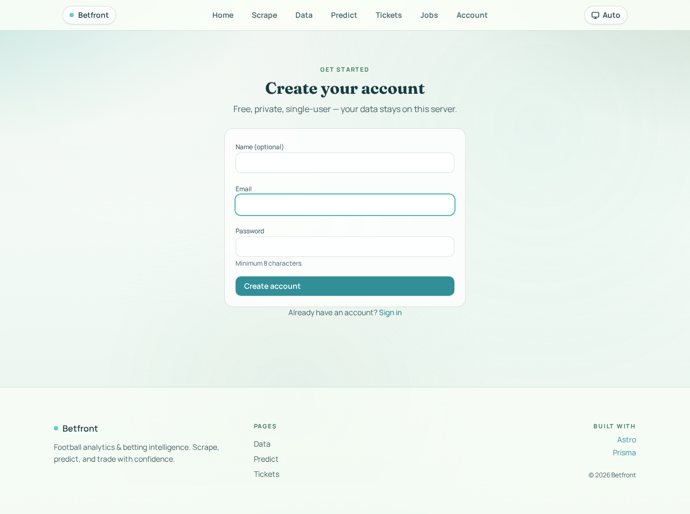
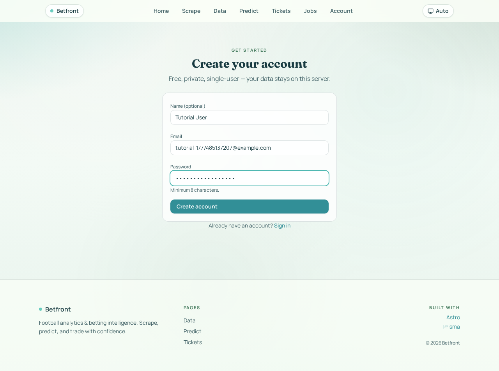
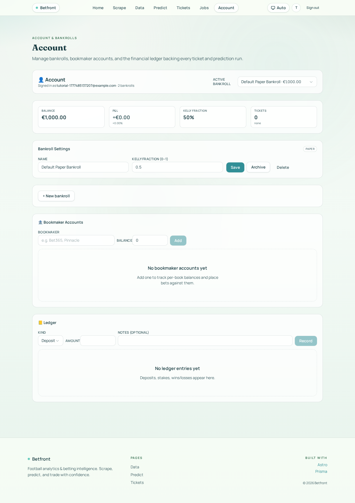
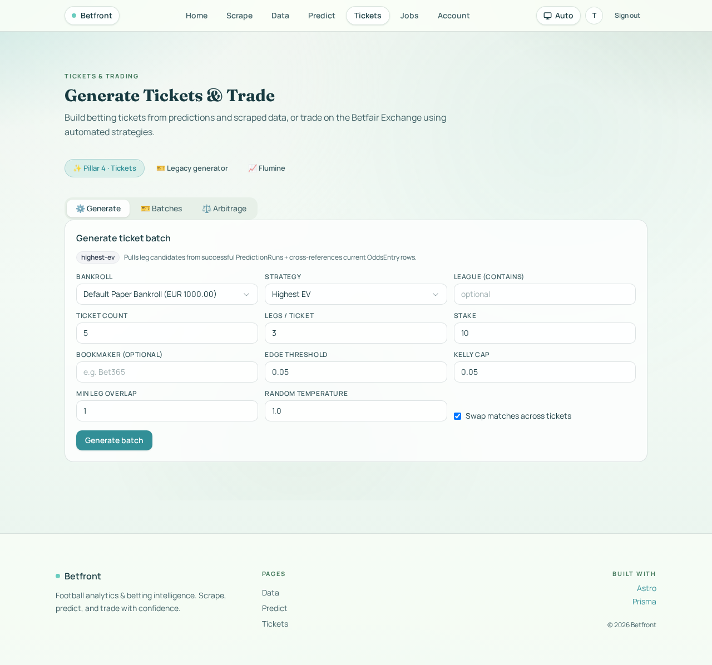
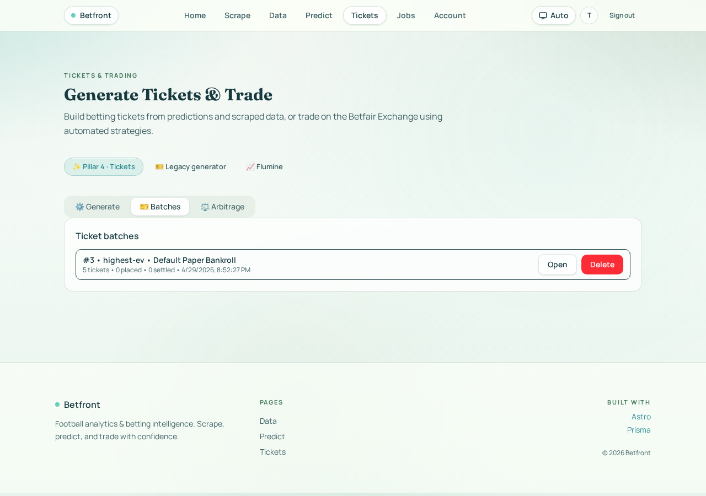

# Tutorial: Generating tickets in Betfront

This walkthrough takes a fresh user from signup to a populated batch of generated tickets. All screenshots come from the actual app running locally on a seeded SQLite database — see [Reproducing this tutorial](#reproducing-this-tutorial) at the bottom.

## Prerequisites

Three pieces of upstream data are required before tickets can be generated:

| Need | Where it's created | Why |
|---|---|---|
| User account | `/signup` | Tickets are scoped to *your* bankrolls |
| Bankroll | Auto-created on first `/account` visit | `generateTicketBatch` requires `bankrollId` and verifies ownership ([builder.ts](../src/server/tickets/builder.ts#L78)) |
| Recent odds + a successful prediction run | `/scrape` then `/predict` | Leg candidates come from `OddsEntry × ModelPrediction` ([candidates.ts](../src/server/tickets/candidates.ts)) |

In this tutorial the odds and predictions are pre-seeded by [`scripts/seed-tutorial.ts`](../scripts/seed-tutorial.ts).

---

## Step 1 — Sign up

Open `/signup`. Fill name, email, and a password (≥ 8 characters), then click **Create account**.

| Empty form | Filled form |
|---|---|
|  |  |

On submit, the app POSTs to `/api/auth/signup` (zod-validated), hashes the password with `scrypt`, creates a `Session`, sets the `betfront_session` cookie, and redirects to `/`.

## Step 2 — Visit the Account page

Click **Account** in the top nav. On the very first visit the server runs `ensureDefaultBankroll()` ([account.ts](../src/server/account.ts)) which creates a `Default Paper Bankroll` with €1000 starting balance:



You can rename it, change the Kelly fraction (defaults to 0.5), add **Bookmaker accounts** (needed only later when you *place* a ticket), or click **+ New bankroll** for a real / sandbox / paper second bankroll.

## Step 3 — Open the Tickets page

Click **Tickets** in the nav. The default tab is **Generate**:



Each field maps 1:1 to the [`generateBatchSchema`](../src/server/tickets/types.ts):

| Field | Notes |
|---|---|
| **Bankroll** | Pre-selected to your default bankroll. Must belong to you. |
| **Strategy** | One of 8 algorithms — see table below. |
| **League (contains)** | Optional substring filter on `Match.league` |
| **Ticket count** | 1–50 (default 5) |
| **Legs / ticket** | 1–8 (default 3 — singles=1, accumulators=2+) |
| **Stake** | Per-ticket stake in the bankroll's currency |
| **Bookmaker (optional)** | Pin the legs to a specific bookmaker; otherwise pick best available |
| **Edge threshold** | Used by `value` and `edge-conf` (min `modelProb − 1/odds`) |
| **Kelly cap** | Used by `kelly` (max bankroll fraction per ticket) |
| **Min leg overlap** | Max number of shared legs allowed between any two tickets in the batch |
| **Random temperature** | Used by `weighted-rand` (higher = closer to uniform) |
| **Swap matches across tickets** | Enables the diversity engine — leave on for varied batches |

### Strategies

| Value | Picks legs by |
|---|---|
| `highest-prob` | Largest `modelProb` |
| `highest-odds` | Largest `odds` |
| `highest-ev` | Largest `modelProb × odds − 1` (default) |
| `value` | Only legs with EV ≥ `edgeThreshold` |
| `kelly` | Kelly fraction, capped at `kellyCap` |
| `edge-conf` | EV weighted by `modelProb` (penalises low-confidence) |
| `weighted-rand` | Sampled from softmax(EV / `randomTemperature`) |
| `arbitrage` | Cross-bookmaker dutching (needs ≥ 2 BookmakerAccounts on the bankroll) |

## Step 4 — Generate a batch

Pick a strategy (the screenshot keeps the default **Highest EV**) and click **Generate batch**. The server pipeline:

1. [`buildLegCandidates`](../src/server/tickets/candidates.ts) joins your latest successful `PredictionRun` with current `OddsEntry` rows, filtered by league/window.
2. [`scoreLegs`](../src/server/tickets/strategies/index.ts) ranks candidates per the chosen strategy.
3. [`pickDiverseTicket`](../src/server/tickets/diversity.ts) assembles N tickets honouring `minLegOverlap`.
4. A `TicketBatch` row is created with N child `Ticket` rows + `TicketLeg` rows.

If something is off you'll see a clear error:
- `No leg candidates found — run a prediction first or widen filters.` → no successful `PredictionRun` overlaps your filters.
- `Only X eligible leg(s) for this strategy — need Y.` → relax `edgeThreshold` or pick a less restrictive strategy.
- `Could not assemble any ticket meeting diversity constraints.` → lower `ticketCount` or raise `minLegOverlap`.

## Step 5 — Inspect the batch

Switch to the **Batches** tab. Your new batch appears at the top with strategy, bankroll, ticket count, and creation timestamp:



From here you can **Open** a batch (per-ticket combined odds, model probability, EV, and per-leg breakdown) or **Delete** it (cascades to all `Ticket` and `TicketLeg` rows in the batch).

## Step 6 — Place and settle (next)

Once you're happy with a batch:

1. **Place a ticket** — pick a `BookmakerAccount` on the same bankroll. Server-side ([placement.ts](../src/server/tickets/placement.ts)) creates a `BetPlacement`, debits the stake from the bankroll, and writes a `LedgerEntry`.
2. **Settle the ticket** — when the match resolves, mark `won` / `lost` / `void` with the return amount. A `Settlement` is recorded, the bankroll is credited, a `win` / `loss` `LedgerEntry` is added, and ROI/P&L update on the Account page.

---

## Programmatic use

Tickets can also be generated from a Node script or the browser console:

```ts
import { generateTicketBatch } from '#/server/tickets/builder'

await generateTicketBatch({
  bankrollId: 1,
  strategy: 'kelly',
  ticketCount: 5,
  legsPerTicket: 3,
  stake: 10,
  swapMatches: true,
  minLegOverlap: 1,
  kellyCap: 0.05,
  league: 'Premier',
  markets: ['1x2', 'btts', 'ou_2_5'],
})
```

When called server-side the ownership check uses the AsyncLocalStorage session context. Without a session (e.g. a CLI seed script) the check is skipped — see [`scripts/seed-tutorial-batch.ts`](../scripts/seed-tutorial-batch.ts) for an example.

---

## Reproducing this tutorial

```fish
cd betfront

# 1. fresh DB + seeded fixtures, odds and predictions
rm -f prisma/tutorial.db prisma/tutorial.db-journal
env DATABASE_URL="file:./tutorial.db" pnpm exec prisma db push --accept-data-loss
env DATABASE_URL="file:./tutorial.db" pnpm exec tsx scripts/seed-tutorial.ts

# 2. start the dev server (in one terminal)
env DATABASE_URL="file:./tutorial.db" ALLOW_DEV_USER="0" \
  pnpm exec astro dev --port 3200 --host 127.0.0.1

# 3. drive the UI and capture screenshots (in another terminal)
node scripts/tutorial-screenshots.mjs
```

Screenshots are written to `betfront/docs/tutorial-tickets/`.
